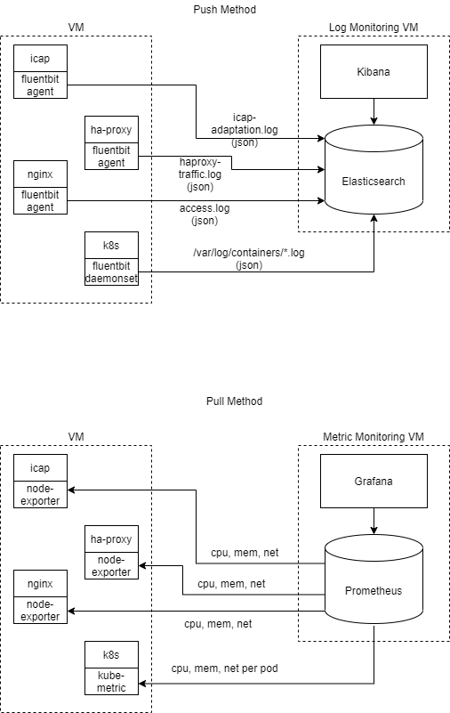

<!-- vscode-markdown-toc -->
* 1. [Monitoring features](#Monitoringfeatures)
* 2. [Diagram](#Diagram)
* 3. [Image](#Image)
* 4. [Install OS](#InstallOS)
* 5. [Install Elasticsearch](#InstallElasticsearch)
* 6. [Install Kibana](#InstallKibana)
* 7. [Log Aggregator](#LogAggregator)
	* 7.1. [Fluentd on each VM](#FluentdoneachVM)
	* 7.2. [Update Configuration](#UpdateConfiguration)
* 8. [Kubernetes logging](#Kuberneteslogging)
	* 8.1. [Create necessary resources](#Createnecessaryresources)
	* 8.2. [Download daemon set manifest](#Downloaddaemonsetmanifest)
	* 8.3. [Update elasticsearch endpoint](#Updateelasticsearchendpoint)
	* 8.4. [Deploy fluentbit daemonset](#Deployfluentbitdaemonset)
* 9. [VM Metrics](#VMMetrics)
	* 9.1. [Clone this repo](#Clonethisrepo)
	* 9.2. [Download, extract and install node_exporter](#Downloadextractandinstallnode_exporter)
	* 9.3. [Create systemd service for node_exporter](#Createsystemdservicefornode_exporter)
	* 9.4. [Test metrics endpoint](#Testmetricsendpoint)
* 10. [Kubernetes Metrics](#KubernetesMetrics)
	* 10.1. [Follow section 9 above to install node_exporter](#Followsection9abovetoinstallnode_exporter)
	* 10.2. [Configure VM_IP_ADDRESS](#ConfigureVM_IP_ADDRESS)
	* 10.3. [Deploy kube-state-metrics](#Deploykube-state-metrics)
	* 10.4. [Test metrics endpoint](#Testmetricsendpoint-1)
* 11. [Credentials](#Credentials)

<!-- vscode-markdown-toc-config
	numbering=true
	autoSave=true
	/vscode-markdown-toc-config -->
<!-- /vscode-markdown-toc -->

# Monitoring OVA


##  1. <a name='Monitoringfeatures'></a>Monitoring features
|Feature          |Type                     |   Status              |  OVAs that support it |
|--	           |--	     	            |--                      |--                    |
|  CPU usage | Host |Implemented |
|  Memory usage |Host | Implemented|
|  Disk usage |Host |Implemented |
|  Network usage |Host |Implemented |
|  Rebuild success rate |Rebuild | Implemented|
|  Rebuild error rate |Rebuild |Implemented |
|  Rebuild rate  |Rebuild |Implemented |
|  CPU usage |	pod | Implemented|
|  Memory usage | pod| Implemented |
|  Disk usage |pod | Implemented |
|  Network usage |pod | Implemented |


##  2. <a name='Diagram'></a>Diagram

##  3. <a name='Image'></a>Image
The OVA is available at this location [s3://glasswall-sow-ova/vms/visualog/visualog.ova](s3://glasswall-sow-ova/vms/visualog/visualog.ova)

##  4. <a name='InstallOS'></a>Install OS
- Download Ubuntu 20.04 Live Server ISO file
- Load VMWare VM CDROM drive with ISO file
- Boot the VM
- Follow the instruction during installation wizard

##  5. <a name='InstallElasticsearch'></a>Install Elasticsearch
```
{
	wget -qO - https://artifacts.elastic.co/GPG-KEY-elasticsearch | sudo apt-key add -
	sudo apt-get install apt-transport-https
	echo "deb https://artifacts.elastic.co/packages/7.x/apt stable main" | sudo tee /etc/apt/sources.list.d/elastic-7.x.list
	sudo apt-get update && sudo apt-get install elasticsearch
	sudo /bin/systemctl daemon-reload
	sudo /bin/systemctl enable elasticsearch.service
	sudo systemctl start elasticsearch.service
}
```

##  6. <a name='InstallKibana'></a>Install Kibana
```
{
	wget -qO - https://artifacts.elastic.co/GPG-KEY-elasticsearch | sudo apt-key add -
	sudo apt-get install apt-transport-https
	sudo apt-get update && sudo apt-get install kibana
	sudo /bin/systemctl daemon-reload
	sudo /bin/systemctl enable kibana.service
	sudo systemctl start kibana.service
}
```

##  7. <a name='LogAggregator'></a>Log Aggregator
###  7.1. <a name='FluentdoneachVM'></a>Fluentd on each VM
```
{
	sudo su -
	wget -qO - https://packages.fluentbit.io/fluentbit.key | sudo apt-key add -
	echo "deb https://packages.fluentbit.io/ubuntu/focal focal main" >>  /etc/apt/sources.list
	apt-get update
	apt-get install -y td-agent-bit
	service td-agent-bit start
}
```
###  7.2. <a name='UpdateConfiguration'></a>Update Configuration
- Rewrite file /etc/td-agent-bit/td-agent-bit.conf at the end of the file
```
[INPUT]
    name cpu
    tag  cpu.local

    # Read interval (sec) Default: 1
    interval_sec 1

[INPUT]
    name mem
    tag  mem.local

[OUTPUT]
    name es
    match *
    Host 78.159.113.37
    Port 9200

[FILTER]
    Name record_modifier
    Match *
    Record hostname ${HOSTNAME}
```
- Restart fluentbit agent.
```
sudo service td-agent-bit restart
```

##  8. <a name='Kuberneteslogging'></a>Kubernetes logging
###  8.1. <a name='Createnecessaryresources'></a>Create necessary resources
```
{
	kubectl create namespace logging
	kubectl create -f https://raw.githubusercontent.com/fluent/fluent-bit-kubernetes-logging/master/fluent-bit-service-account.yaml
	kubectl create -f https://raw.githubusercontent.com/fluent/fluent-bit-kubernetes-logging/master/fluent-bit-role.yaml
	kubectl create -f https://raw.githubusercontent.com/fluent/fluent-bit-kubernetes-logging/master/fluent-bit-role-binding.yaml
	kubectl create -f https://raw.githubusercontent.com/fluent/fluent-bit-kubernetes-logging/master/output/elasticsearch/fluent-bit-configmap.yaml
}
```
###  8.2. <a name='Downloaddaemonsetmanifest'></a>Download daemon set manifest
```
wget https://raw.githubusercontent.com/fluent/fluent-bit-kubernetes-logging/master/output/elasticsearch/fluent-bit-ds.yaml
```
###  8.3. <a name='Updateelasticsearchendpoint'></a>Update elasticsearch endpoint
```
        - name: FLUENT_ELASTICSEARCH_HOST
          value: "78.159.113.37"
        - name: FLUENT_ELASTICSEARCH_PORT
          value: "9200"
```
###  8.4. <a name='Deployfluentbitdaemonset'></a>Deploy fluentbit daemonset
```
kubectl create -f fluent-bit-ds.yaml
```
##  9. <a name='VMMetrics'></a>VM Metrics
To collect VM metrics, please follow the instruction
###  9.1. <a name='Clonethisrepo'></a>Clone this repo
```
	git clone https://github.com/k8-proxy/vmware-scripts
	cd GW-proxy/OVAs-creation
```
###  9.2. <a name='Downloadextractandinstallnode_exporter'></a>Download, extract and install node_exporter
```
{
    wget https://github.com/prometheus/node_exporter/releases/download/v1.0.1/node_exporter-1.0.1.linux-amd64.tar.gz
    tar xvzf node_exporter-1.0.1.linux-amd64.tar.gz
    sudo cp node_exporter-1.0.1.linux-amd64/node_exporter /usr/sbin/
}    
```
###  9.3. <a name='Createsystemdservicefornode_exporter'></a>Create systemd service for node_exporter
```
{
	sudo useradd node_exporter -s /sbin/nologin
    sudo cp monitoring-scripts/node_exporter.service /etc/systemd/system/
    sudo mkdir -p /etc/prometheus
    sudo cp monitoring-scripts/node_exporter.config /etc/prometheus/node_exporter.config
    sudo systemctl daemon-reload
    sudo systemctl enable node_exporter
    sudo systemctl start node_exporter
    sudo systemctl status node_exporter
}
```
###  9.4. <a name='Testmetricsendpoint'></a>Test metrics endpoint
```
curl http://localhost:9100/metrics
...
go_gc_duration_seconds{quantile="0"} 4.475e-06
go_gc_duration_seconds{quantile="0.25"} 5.511e-06
go_gc_duration_seconds{quantile="0.5"} 6.16e-06
go_gc_duration_seconds{quantile="0.75"} 7.375e-06
go_gc_duration_seconds{quantile="1"} 3.3781e-05
go_gc_duration_seconds_sum 0.000510228
go_gc_duration_seconds_count 67
...
```
##  10. <a name='KubernetesMetrics'></a>Kubernetes Metrics
To collect Kubernetes metrics, please follow the instruction
###  10.1. <a name='Followsection9abovetoinstallnode_exporter'></a>Follow section 9 above to install node_exporter 
###  10.2. <a name='ConfigureVM_IP_ADDRESS'></a>Configure VM_IP_ADDRESS
Open file ```monitoring-scripts/k8s/service.yaml``` and change variable ```VM_IP_ADDRESS``` to the assigned VM IP Address
###  10.3. <a name='Deploykube-state-metrics'></a>Deploy kube-state-metrics
```
	kubectl apply -f monitoring-scripts/k8s
```
###  10.4. <a name='Testmetricsendpoint-1'></a>Test metrics endpoint
```
	curl http://VM_IP_ADDRESS:8080/metrics
```
You should see metrics name with prefix kube_  
##  11. <a name='Credentials'></a>Credentials
Username: ubuntu
Password: ubuntu123
