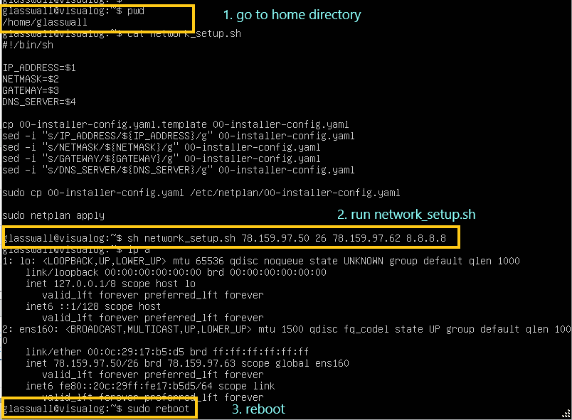

# How to use monitoring ova
## Download OVA
The OVA is available at this location [s3://glasswall-sow-ova/vms/visualog/visualog.ova](s3://glasswall-sow-ova/vms/visualog/visualog.ova)
## Launch a VM instance
Use ESXi to launch an instance using above OVA
## Configure Network
### Manual configuration
Update the IP Address, Netmask and Gateway in file /etc/netplan/00-installer-config.yaml
### Scripted configuration
Use network_setup.sh. 
```
    sh network_setup.sh IP_ADDRESS NETMASK GATEWAY DNS_SERVER
```
See a screenshot below:
[]()

### Check outgoing connection
```
    ping 8.8.8.8
``` 
### Check incoming connection
```
    telnet VM_IP_ADDRESS 9200
```
## Configure metrics monitoring 
Note: this is temporary solution until push method is used for metrics monitoring. It shouldn't be needed anymore in the next OVA releases that use push method.
### Edit file /etc/prometheus/prometheus.yml 
- Collect VM IP Addresses 
- Add a job for each IP
```
scrape_configs:
   - job_name: VM_NAME
     scrape_interval: 5s
     static_configs:
     - targets: ['VM_IP_ADDRESS:9100']
```
## Configure kibana
### Edit VM IP Address
Open file /etc/kibana/kibana.yaml and replace the value of ```server.host``` to the VM IP Address
