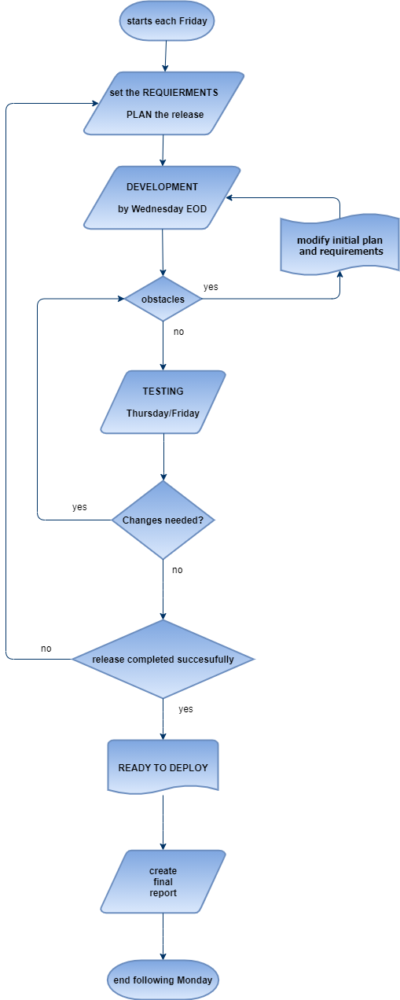

## Release Process Flow Diagram

The main goals taken into consideration in the flow diagram are:

- setting requirements and planning tasks for the week on **Fridays**
- development ends on **Wednesdays**
- testing starts on **Thursdays** and ends on **Fridays**
- deployments are ready by **Mondays**



## Initial release_info.yaml 

### Version Number
- version release x.y.z, where x defines a major change, y defines a minor change, and z defines a patch
  - initial development release v0.1.0 (increment from here)
  - pre-release [1.0.0-alpha < 1.0.0-alpha.1 < 1.0.0-alpha.beta < 1.0.0-beta < 1.0.0-beta.2 < 1.0.0-beta.11 < 1.0.0-rc.1 < 1.0.0]
  - initial production release v1.0.0 (increment from here)
### Time & Date Format [python import]
- time: HH:MM:SS
- date: yyyy-mm-dd
- python code:
  ```
  import datetime
  now = datetime.datetime.now()
  print ("Current date and time : ")
  print (now.strftime("%Y-%m-%d %H:%M:%S"))
  ```
### Template
```
<OVA_NAME>:
  virtual_machine_type:
    server:
      - HAProxy-ICAP
      - ICAP-server
      - Shared Storage
      - Traffic Generator
      - Support
      - Proxy
      - Monitoring
    client:
      - ICAP-Client
      - Linux-Desktop
    website:
      - Minio-server
      - Wordpress
      - File-drop
      - gov.uk
      - HAProxy-web
  usage:
  description:
  release_date_time: yyyy-mm-dd HH:MM:SS
  version: v1.0.0
  dependencies:
    in_VM: # add dependencies within the VM
    other_VM: # add dependencies between VMs (i.e. another VM is required for certain VMs to work)
  fixes:
  new_features:
```

### Example

```
SOW_REST_OVA:
  virtual_machine_type:
    - website
  usage: Proxied file-drop.com website
  description: Deploys file-drop.com on isolated VM
  release_date_time: 2020-12-12 16:46:23
  version_number: v1.0.0
  dependencies:
    in_VM:
      [curl, git]
    other_VM:
      none
  fixes: stronger password
  new_features: automatic network change
```
